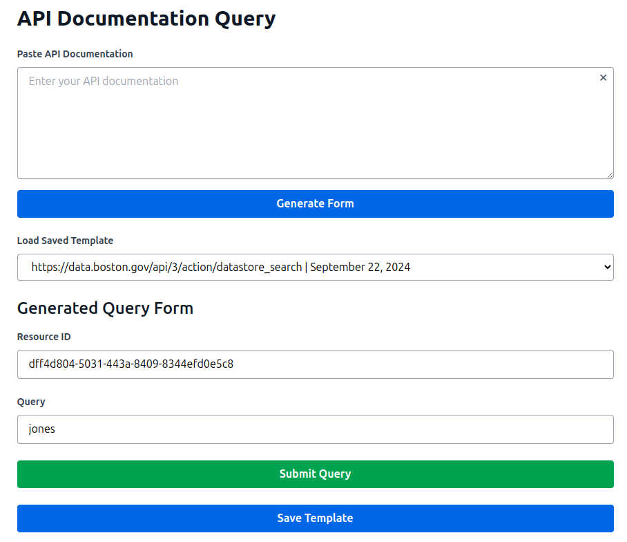

# Example Workflow for the API Documentation Query Tool

Below is a step-by-step guide on how to use the API Documentation Query Tool. This example showcases a basic API query scenario, from pasting the API documentation to submitting a query and viewing the responses.

## Step 1: Paste the API Documentation

In this step, the user copies the API documentation into the provided textarea. This documentation will be processed to generate a query form.


## Step 2: Generate the Form

After pasting the API documentation, the user clicks the "Generate Form" button. The tool processes the documentation and generates a form based on the parameters provided in the API documentation.



## Step 3: Submit the Query

Once the form is generated, the user can fill in the required fields and click the "Submit Query" button to send the request to the API. The response from the API will be displayed below the form.


## Instructional Guide

The application includes an instructional guide that provides detailed steps on how to use the API Documentation Query Tool. This guide can be toggled for visibility during the usage of the application.


# IRIS API Interface Generator

## Introduction

- [What is the API Documentation Query Tool?](#what-is-the-api-documentation-query-tool)
- [Key Features](#key-features)

## Quickstart

- [Setup and Configuration](#setup-and-configuration)
- [Usage](#usage)

## Application Overview

- [Functionality](#functionality)
- [Interface Overview](#interface-overview)
- [Using the Interface](#using-the-interface)
  - [Paste API Documentation](#paste-api-documentation)
  - [Generate Form Button](#generate-form-button)
  - [Generated Query Form](#generated-query-form)
  - [Submit Query Button](#submit-query-button)
  - [Responses and Save Option](#responses-and-save-option)
- [Developer Tips](#developer-tips)

## Backend

- [Views](#views)
  - [`query_openai(request)`](#query_openairequest)
  - [`submit_query(request)`](#submit_queryrequest)
  - [`save_query(request)`](#save_queryrequest)
- [Dependencies](#dependencies)

## Frontend

- [Components](#components)
  - [Features](#features)
- [Interface](#interface)
  - [Main Sections](#main-sections)
- [Script](#script)
  - [Data](#data)
  - [Methods](#methods)
- [Styles](#styles)

## License

- [License](#license)

---

## What is the API Documentation Query Tool?

The API Documentation Query Tool is a powerful application that allows users to interact with third-party APIs by generating dynamic forms based on the APIs' documentation. By simply pasting the API documentation into the tool, users can create custom query forms that enable them to send requests directly to the API and receive responses, all without manual coding.

## Key Features

- **Dynamic Form Generation**: Automatically generates user-friendly forms from pasted API documentation.
- **Direct API Interaction**: Allows submission of queries directly to third-party APIs using the generated forms.
- **Response Display and Saving**: Displays API responses and provides options to save them for future reference.
- **Instructional Guide**: Includes an in-app instructional component to assist users.
- **Modern UI**: Built with Vue.js and styled with Tailwind CSS for a responsive and intuitive interface.

---

## Quickstart

### Setup and Configuration

1. **Clone the Repository:**

   ```bash
   git clone https://github.com/yourusername/yourrepository.git
   cd yourrepository
   ```

2. **Create a `.env` File:**

   - Place it in the root directory with your Docker file.
   - Add your `OPENAI_API_KEY`.

     ```bash
     OPENAI_API_KEY=sk-your-openai-api-key
     ```

3. **Run `docker-compose build`:**

   - The Docker file and `entrypoint.sh` script will handle the rest of the installation and migration.

4. **Change Permissions on the Repository Folder:**

   - To allow the Docker container's internal users to write to the repository directory, set full permissions.

     ```bash
     chmod -R 777 .
     ```

5. **Run `docker-compose up`:**

   - This will start the application.

### Usage

1. **Access the Application:**

   - Frontend: `http://localhost:53795/`

---

## Application Overview

### Functionality

The application enables users to:

- **Paste API Documentation**: Input API documentation into a text area.
- **Generate Dynamic Forms**: Create forms based on the API documentation using OpenAI's GPT-4.
- **Submit Queries**: Fill out the generated forms to send requests directly to third-party APIs.
- **View and Save Responses**: Display the API responses and provide options to save them.

### Interface Overview

The user interface includes:

- **API Documentation Input**: A textarea to paste the API documentation.
- **Generate Form Button**: Initiates the form generation process.
- **Generated Query Form**: A dynamic form created based on the API documentation.
- **Submit Query Button**: Sends the filled form data to the third-party API.
- **Responses Section**: Displays API responses with an option to save them.
- **Instructional Component**: Provides a guide on how to use the application.

### Using the Interface

#### Paste API Documentation

- **Description**: Paste your API documentation (e.g., Swagger specs, OpenAPI definitions) into the provided textarea.

#### Generate Form Button

- **Description**: Click this button to generate a dynamic form based on the pasted API documentation.

#### Generated Query Form

- **Description**: Fill out the dynamically generated form fields that correspond to the API's parameters.

#### Submit Query Button

- **Description**: After completing the form, click this button to submit your query directly to the third-party API.

#### Responses and Save Option

- **Description**: View the API's response in this section. You can also save the response for future reference by clicking the "Save Response" button.

### Developer Tips

- **OpenAI API Key**: Ensure your OpenAI API key is correctly set in the `.env` file.
- **CSRF Tokens**: The application uses CSRF tokens for security. Ensure that the CSRF token is included in your requests.
- **API Rate Limits**: Be mindful of any rate limits imposed by the third-party APIs and OpenAI.

---

## Backend

### Views

#### `query_openai(request)`

**Description:**

- Receives the API documentation from the frontend.
- Uses OpenAI's GPT-4 to parse the documentation and generate form fields and the base URL.
- Returns the form fields and base URL to the frontend for form rendering.

**Key Points:**

- Validates that the prompt (API documentation) is provided.
- Uses OpenAI's function calling feature to extract necessary information.
- Handles exceptions and returns appropriate error messages.

#### `submit_query(request)`

**Description:**

- Receives the base URL and form data from the frontend.
- Makes a GET request to the third-party API using the provided data.
- Returns the API's response to the frontend.

**Key Points:**

- Validates that both `base_url` and `form_data` are provided.
- Uses the `requests` library to interact with the third-party API.
- Handles HTTP errors and exceptions, providing meaningful error messages.

#### `save_query(request)`

**Description:**

- Saves the API response to the database for future reference.
- Returns a success message upon successful save.

**Key Points:**

- Utilizes Django REST Framework serializers for data validation.
- Ensures data integrity and handles validation errors.

### Dependencies

- **Django**: The web framework used for the backend.
- **Django REST Framework**: Facilitates the creation of RESTful APIs.
- **OpenAI Python Library**: For interacting with OpenAI's GPT-4 model.
- **Requests**: For making HTTP requests to third-party APIs.
- **JSON**: For handling JSON data serialization and deserialization.
- **VueCookies**: For managing cookies, specifically for CSRF tokens.

---

## Frontend

### Components

- **Main Component**: Manages the API documentation input, form generation, query submission, and response display.
- **Instructional Component**: Provides step-by-step instructions on how to use the application.

#### Features

- **Dynamic Form Rendering**: Generates form fields based on the API documentation.
- **Response Handling**: Displays responses from the third-party API and allows users to save them.
- **Instructional Guide**: Users can toggle the visibility of instructions for assistance.

### Interface

#### Main Sections

1. **Header**: Displays the application title: "API Documentation Query".
2. **API Documentation Input**: A textarea for users to paste their API documentation.
3. **Generate Form Button**: Triggers the generation of the dynamic form.
4. **Generated Query Form**: The form generated based on the API documentation.
5. **Submit Query Button**: Sends the filled form data to the backend.
6. **Responses Section**: Shows the API responses with options to save them.
7. **Instructional Component**: An optional section providing usage instructions.

### Script

#### Data

- **apiDocumentation**: Stores the pasted API documentation.
- **generatedFormFields**: Holds the form fields generated from the API documentation.
- **baseUrl**: Stores the base URL extracted from the API documentation.
- **responses**: An array of responses received from the API.
- **isGeneratingForm**: A boolean indicating if the form is being generated.

#### Methods

- **submitApiDocumentation()**: Sends the API documentation to the backend to generate the form.
- **submitQueryFromGeneratedForm()**: Submits the form data to the backend, which then queries the third-party API.
- **saveResponse(index)**: Saves a specific response to the database.
- **clearDocumentation()**: Clears the API documentation input field.
- **hideInstructions() / showInstructionsFunc()**: Toggles the visibility of the instructional component.

---

## Styles

- **Tailwind CSS**: Utilized for styling the application, ensuring a modern and responsive user interface.

---

## License

This project is licensed under the MIT License. See the [LICENSE](LICENSE) file for details.

---

Feel free to customize any section further to better fit your application's specifics or to add more details where necessary.